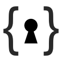

What is ADVobfuscator?
======================



**ADVobfuscator** is a library that uses the `C++20` language to generate, at compile time, obfuscated data and code without using any external tool and without modifying the compiler.
Strings or blocks of data can be obfuscated or encrypted at compile time, and they are decoded at runtime:


How to use it?
==============

The [documentation](https://github.com/andrivet/ADVobfuscator/docs/ADVobfuscator.pdf) explains how the library is built, how to install and use it.

Look also at the examples in the `Examples` folder.

Requirements
------------

* A `C++20` compatible compiler (i.e. a compiler that is not too old).
* Support of the C++20 Standard Library. It is generally the case if your compiler supports C++20. There are however exceptions, especially for embedded environments.
* CMake 3.14 if you want to build the examples with CMake (this is optional).

Examples
--------

### Linux and macOS (CMake)

```
mkdir -p BUILD
cd BUILD
cmake ..
cmake --build .
```

Each example is in its subdirectory. For example `./example/demo`.

### Windows (Visual Studio 22)

Open `ADVobfuscator.sln`.

Debug Builds
-------------

Debug builds are very special: Compiler do not have (and do not most of the time) respect statements such as `inline` or `constexpr`. All optimizations are also, by default, disabled. Compilers are doing this for a good reason: let you debug, single step, etc.

As a consequence, **ADVobfuscator** is **not** compatible with Debug builds.
You can compile in Debug but in this case, the strings or data will not be obfuscated.
Obfuscation works only for Release builds.

Compatibility
=============

**ADVobfuscator** has been tested with:

Compiler            | Version  | OS         | CPU     | Obfuscation | AES     |
--------------------|----------|------------|---------|-------------|---------|
Apple Clang         | 17.0.0   | macOS 15   | AArch64 | YES         | limited |
Clang               | 21.1.8   | Debian 14  | x86_64  | YES         | limited |
Clang               | 19.1.7   | Debian 13  | x86_64  | YES         | limited |
Clang               | 18.1.8   | Debian 13  | x86_64  | YES         | limited |
Clang               | 17.0.6   | Debian 13  | x86_64  | YES         | limited |
GCC                 | 15.1.0   | macOS 15   | x86_64  | YES         | YES     |
GCC                 | 14.2.0   | macOS 15   | AArch64 | YES         | YES     |
GCC                 | 14.2.0   | Debian 13  | x86_64  | YES         | YES     |
GCC                 | 13.3.0   | macOS 15   | AArch64 | NO          | NO      |
Visual Studio 2022  | 17.14.13 | Windows 11 | AArch64 | YES         | limited |
Visual Studio 2026  | 18.0.339 | Windows 11 | AArch64 | YES         | limited |

Other compilers are probably compatible if they are `C++20` compliant.


Files and Folders
=================

| Files and Folders           | Description                         |
|-----------------------------|-------------------------------------|
| `README.md`                 | This file                           |
| `include/advobfuscator`     | **ADVobfuscator** library           |
| `Examples`                  | Examples of using **ADVobfuscator** |

### Lib

| Files          | Description                                                    |
|----------------|----------------------------------------------------------------|
| `aes.h`        | Obfuscation using AES-128 compile time encryption              |
| `aes_string.h` | Obfuscated strings using AES-128 compile time encryption       |
| `bytes.h`      | Obfuscated blocks of bytes                                     |
| `fsm.h`        | Compile time finite state machine to obfuscate function calls  |
| `obj.h`        | Obfuscation                                                    |
| `random.h`     | Generate random numbers at compile time                        |
| `string.h`     | Obfuscated strings                                             |
| `format.h`     | std::format Formatting of strings                              |


Copyright and license
=====================

Copyright (c) 2025 Sebastien Andrivet
All rights reserved.

Redistribution and use in source and binary forms, with or without
modification, are permitted (subject to the limitations in the disclaimer
below) provided that the following conditions are met:

     * Redistributions of source code must retain the above copyright notice,
     this list of conditions and the following disclaimer.

     * Redistributions in binary form must reproduce the above copyright
     notice, this list of conditions and the following disclaimer in the
     documentation and/or other materials provided with the distribution.

     * Neither the name of the copyright holder nor the names of its
     contributors may be used to endorse or promote products derived from this
     software without specific prior written permission.

NO EXPRESS OR IMPLIED LICENSES TO ANY PARTY'S PATENT RIGHTS ARE GRANTED BY
THIS LICENSE. THIS SOFTWARE IS PROVIDED BY THE COPYRIGHT HOLDERS AND
CONTRIBUTORS "AS IS" AND ANY EXPRESS OR IMPLIED WARRANTIES, INCLUDING, BUT NOT
LIMITED TO, THE IMPLIED WARRANTIES OF MERCHANTABILITY AND FITNESS FOR A
PARTICULAR PURPOSE ARE DISCLAIMED. IN NO EVENT SHALL THE COPYRIGHT HOLDER OR
CONTRIBUTORS BE LIABLE FOR ANY DIRECT, INDIRECT, INCIDENTAL, SPECIAL,
EXEMPLARY, OR CONSEQUENTIAL DAMAGES (INCLUDING, BUT NOT LIMITED TO,
PROCUREMENT OF SUBSTITUTE GOODS OR SERVICES; LOSS OF USE, DATA, OR PROFITS; OR
BUSINESS INTERRUPTION) HOWEVER CAUSED AND ON ANY THEORY OF LIABILITY, WHETHER
IN CONTRACT, STRICT LIABILITY, OR TORT (INCLUDING NEGLIGENCE OR OTHERWISE)
ARISING IN ANY WAY OUT OF THE USE OF THIS SOFTWARE, EVEN IF ADVISED OF THE
POSSIBILITY OF SUCH DAMAGE.
